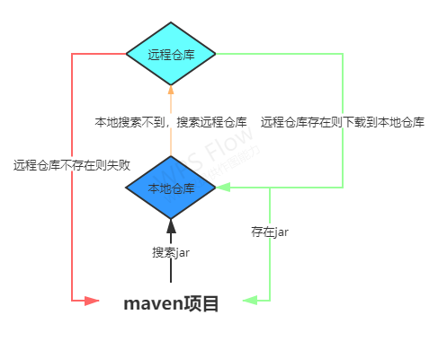

### 彻底理解settings.xml的mirror节点的mirrorOf属性

如果还不清楚仓库、镜像等这些属性的可以去看：[聊聊maven本地仓库、中央仓库、镜像等概念以及关系](./聊聊maven本地仓库、中央仓库、镜像等概念以及关系.md)

上来反手就是一张图：

正常情况下我们请求jar包的过程就如上图所示，但由于中央仓库在国外我们国内用户使用的时候由于网络原因往往加载比较慢，并且中央仓库压力大所以呢有些高校、大企业就自己搭建了镜像仓库。镜像顾名思义就是像拷贝的一份中央仓库一样，这样一来国内用户配置这个镜像仓库然后拉包的时候就不需要去中央仓库而去这个镜像仓库就可以了，当然了速度也会快很多。例如：

```xml
<mirrors>
        <!--国内阿里云提供的镜像，非常不错-->
    <mirror>
        <!--This sends everything else to /public -->
        <id>aliyun_nexus</id>
        <!--对所有仓库使用该镜像,除了一个名为maven_nexus_201的仓库除外-->
        <!--这个名为maven_nexus_201的仓库可以在javamaven项目中配置一个repository-->
        <mirrorOf>*</mirrorOf> 
        <url>http://maven.aliyun.com/nexus/content/groups/public/</url>
    </mirror>
</mirrors>
```
那今天的问题就来了，mirror节点一共就三个属性id、mirrorOf、url第一个和第三个不用说都知道是干啥的，那第二个mirrorOf是什么意思呢？

这个mirrorOf实际上是镜像仓库的高级用法，具体配置和意义如下：

1. <mirrorOf>*</mirrorOf>
匹配所有远程仓库。所有的请求都会转发到这个镜像。

2. <mirrorOf>external:*</mirrorOf>
匹配所有远程仓库，使用localhost的除外，使用file://协议的除外。也就是说，匹配所有不在本机上的远程仓库。

3. <mirrorOf>repo1,repo2</mirrorOf>
匹配仓库repo1和repo2，使用逗号分隔多个远程仓库。只有这两个仓库的请求才会转发到这个镜像上。

4. <mirrorOf>*,!repo1</miiroOf>
匹配所有远程仓库，repo1除外，使用感叹号将仓库从匹配中排除。除了请求repo1之外的请求都会转发到这个镜像上。

需要注意的是，由于镜像仓库完全屏蔽了被镜像仓库，当镜像仓库不稳定或者停止服务的时候，Maven仍将无法访问被镜像仓库，因而将无法下载构件。

根据以上说明我们就可以解决很多实际问题，比如：[真正解决maven私服仓库和远程仓库共存问题](./真正解决maven私服仓库和远程仓库共存问题.md)