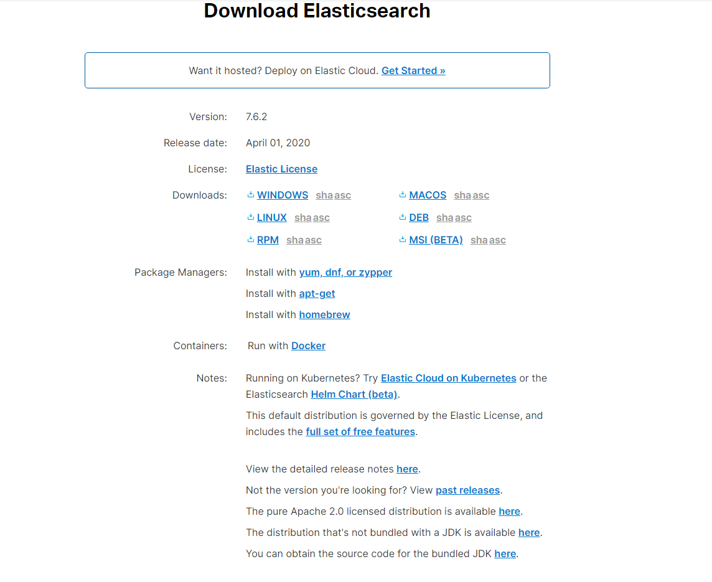
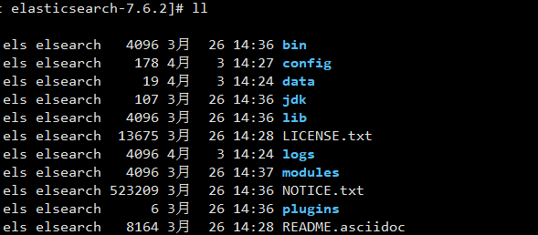

**安装**

1. 从(官网下载)[https://www.elastic.co/cn/downloads/elasticsearch]对应的安装包，如图：



解压：
```
tar -xvf elasticsearch-7.6.2
```
目录结构：


centos下创建用户并配置文件权限：
```
groupadd elsearch
[root@localhost home]# useradd els -g elsearch -p 123456
[root@localhost home]# chown -R els:elsearch elasticsearch-7.6.2
```

修改系统配置（以下修改都使用root权限）：

limits.conf
```
vim /etc/security/limits.conf
```
添加如下内容到文件末尾
```
*               soft    nofile   65536
*               hard    nofile    131072
*               soft    nproc     2048
*               hard    nproc     4096
```

*-nproc.conf
这里你需查看系统生成的文件名是什么（每个系统生成的数字各不一样），可以看到我这里是20-nproc.conf，然后编辑它
```
ls /etc/security/limits.d/
20-nproc.conf
vim /etc/security/limits.d/20-nproc.conf
```
添加如下内容：
```
soft nproc 2048
```
如果你的文件里面本身已经有了这个配置，如果比2048小则修改为2048否则不变

sysctl.conf
```
vim /etc/sysctl.conf
```
添加下面配置：
```
vm.max_map_count=655360
```
并执行命令：

```
sysctl -p
```

elasticsearch.yml
修改elasticsearch绑定的IP地址：
```
config/elasticsearch.yml
```
找到Network相关的配置天添加如下内容，IP修改为你自己的IP：
```
 network.host: 192.168.31.71
```
注：如果你是配置的计算机访127.0.0.1则不需要修改，否则如果是其他计算机浏览器打开则无法访问的到，因为它默认绑定的ip是127.0.0.1

打开下面这个注释，否则报错：
```
cluster.initial_master_nodes: ["node-1", "node-2"]
```
并且改为：
```
node.name: node-1  #这个注释要打开并且和下面数组里面的值一样
cluster.initial_master_nodes: ["node-1"]
gateway.recover_after_nodes: 1   #这个值和上面数组个数一直
```

**启动运行**

切换账号到els运行elasticsearch：
```
su els
bin/elasticsearch
```
浏览器打开如上地址 http://192.168.31.71:9200/ ，出现如下信息为正常启动：
```
{
  "name" : "localhost.localdomain",
  "cluster_name" : "elasticsearch",
  "cluster_uuid" : "_na_",
  "version" : {
    "number" : "7.6.2",
    "build_flavor" : "default",
    "build_type" : "tar",
    "build_hash" : "ef48eb35cf30adf4db14086e8aabd07ef6fb113f",
    "build_date" : "2020-03-26T06:34:37.794943Z",
    "build_snapshot" : false,
    "lucene_version" : "8.4.0",
    "minimum_wire_compatibility_version" : "6.8.0",
    "minimum_index_compatibility_version" : "6.0.0-beta1"
  },
  "tagline" : "You Know, for Search"
}
```

当我们ctrl+c它就停止运行了，使用如下命令可以让es后台启动
```
./elasticsearch -d
```
若是es的后台运行，则用kill -9 进程号来停止：
```
[els@localhost elasticsearch-7.6.2]$ jps
14001 Elasticsearch
14078 Jps
```
```
kill -9 14001
```

参考文档：

[ELK第一篇:Elasticsearch安装](https://blog.csdn.net/zjcjava/article/details/78643542)

[ELK快速搭建日志平台](https://www.cnblogs.com/cjsblog/p/9517060.html)