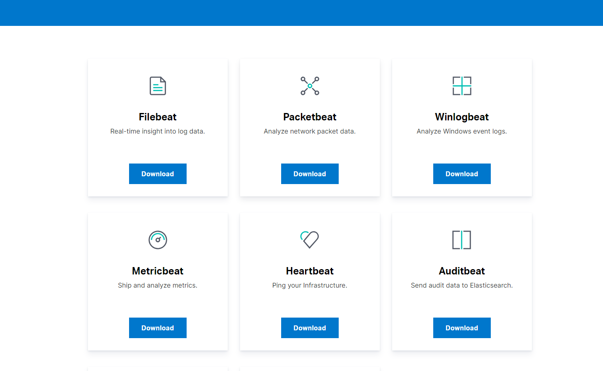
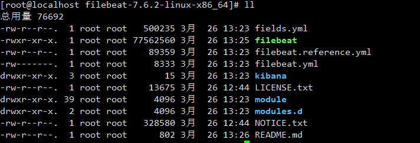

**安装**

1. 从(官网下载)[https://www.elastic.co/cn/downloads/beats]对应的安装包，如图：


(画外音：有不同的beat，根据你的需求下载，这里我使用的是filebeat)

解压：
```
tar -xvf  filebeat-7.6.2-linux-x86_64.tar.gz
```
目录结构：


**启动**

配置filebeat.yml
```
filebeat.inputs:
- type: log
  enabled: true
  paths:
    - /usr/local/programs/logstash/logstash-tutorial.log

output.logstash:
  #改为自己安装的logstash的IP
  hosts: ["localhost:5044"]
```
启动filebeat
```
./filebeat -e -c filebeat.yml -d "publish"
```
 
下一步：[用Grok过滤器插件解析日志](use-logstash-plugin-grok.md)

参考文档：

[Logstash介绍](https://www.cnblogs.com/cjsblog/p/9459781.html)

[开始使用Filebeat](https://www.cnblogs.com/cjsblog/p/9445792.html)