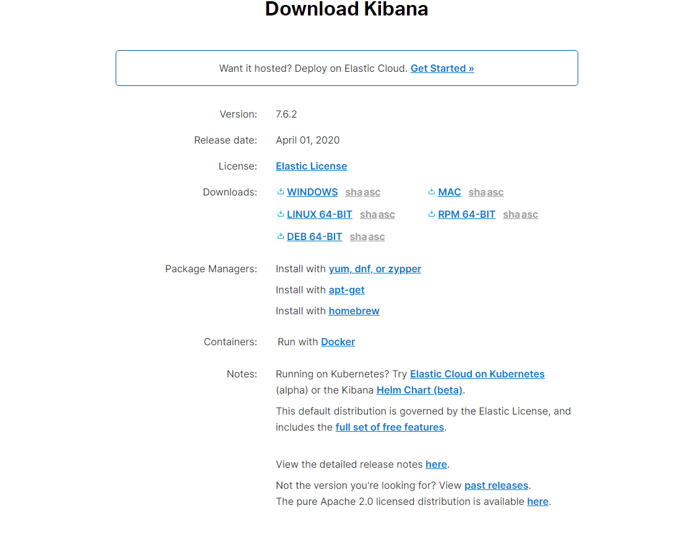
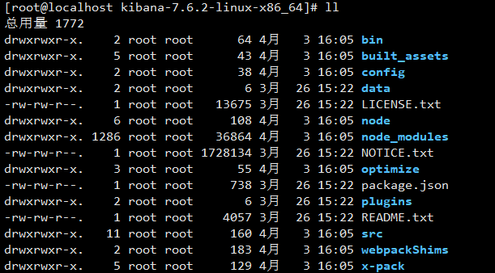
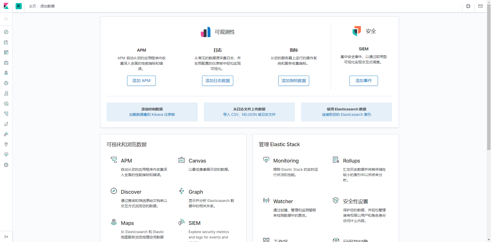

**安装**

1. 从(官网下载)[https://www.elastic.co/cn/downloads/kibana] 对应的安装包，如图：



解压：
```
tar -xvf kibana-7.6.2-linux-x86_64.tar.gz 
```
目录结构：


修改配置文件：config\kibana.yml，配置文件里面有很多重要的默认配置信息，去掉前面的#注释即可：
```
server.port: 5601
server.host: "localhost"   #改为自己的IP，例如192.168.31.71
elasticsearch.hosts: ["http://localhost:9200"]  改为ES的IP，例如192.168.31.71
kibana.index: ".kibana"
logging.dest: stdout   #可改为自己指定的地址，例如/home/log/kibana.log
i18n.locale: "zh-CN"
```

**启动运行**

```
bin/kibana --allow-root
```
后台启动：
```
nohup bin/kibana --allow-root &
```
注意：kibana默认不支持以root用户运行所以要加--allow-root

访问地址 http://192.168.31.71:5601/ 如图：


下一步：[安装Logstash](install-logstash.md)

参考文档：

[ELK 日志分析系统部署](https://blog.csdn.net/zjcjava/article/details/98851573)

[Kibana（一张图片胜过千万行日志）](https://www.cnblogs.com/cjsblog/p/9476813.html)

[es连接不上kibana](https://elasticsearch.cn/question/2144)

[kibana-Request Timeout after 30000ms故障解决](https://www.cnblogs.com/happy-king/p/9597608.html)

[ELK安装流程和ELK安装遇到的所有坑](https://blog.csdn.net/yybk426/article/details/80090238)