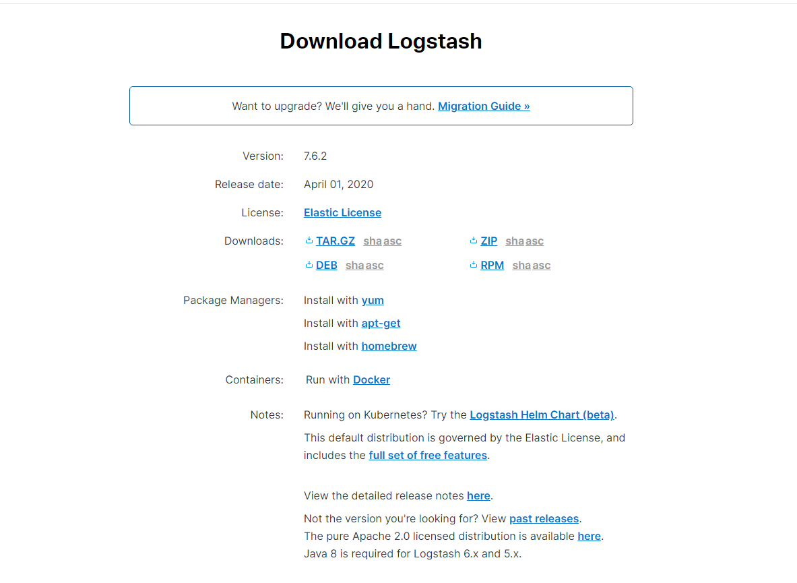
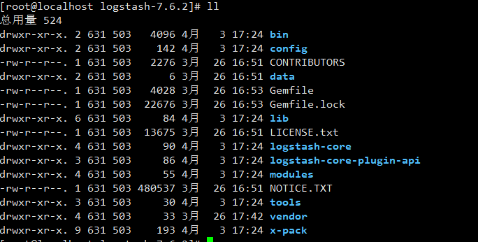

**安装**

1. 从(官网下载)[https://www.elastic.co/cn/downloads/logstash] 对应的安装包，如图：



解压：
```
tar -xvf logstash-7.6.2.tar.gz
```
目录结构：


**启动**

使用命令启动如下：

#输出数据到控制台，调试时使用
```
logstash -e "input { stdin { } } output { stdout { codec => rubydebug } }"
```
（画外音：选项 -e 的意思是允许你从命令行指定配置）

#输出数据到elasticsearch 并配置号ip
```
logstash -e "input { stdin { } } output { elasticsearch { hosts => localhost } }"
```

使用配置文件启动：
```
cd config
cp  logstash-sample.conf  logstash.conf
```

修改相关配置
```
# Sample Logstash configuration for creating a simple
# Beats -> Logstash -> Elasticsearch pipeline.

input {
  #用Beats输入插件
  beats {
    port => 5044
  }
}

output {
  elasticsearch {
    hosts => ["http://localhost:9200"]  #修改为elasticsearch的IP
    index => "%{[@metadata][beat]}-%{[@metadata][version]}-%{+YYYY.MM.dd}"
    #user => "elastic"
    #password => "changeme"
  }
}
```

检查配置
```
bin/logstash -f logstash.conf --config.test_and_exit
```
(画外音：–config.test_and_exit选项的意思是解析配置文件并报告任何错误)

启动logstash
```
bin/logstash -f config/logstash.conf --config.reload.automatic
```
(画外音：–config.reload.automatic选项的意思是启用自动配置加载，以至于每次你修改完配置文件以后无需停止然后重启Logstash)

调试模式，启动后访问端口可以看到配置信息，此端口外网无法访问
http://localhost:9600/

下一步：[安装启动Filebeat](install-filebeat.md)

参考文档：

[Logstash介绍](https://www.cnblogs.com/cjsblog/p/9459781.html)

[ELK 日志分析系统部署](https://blog.csdn.net/zjcjava/article/details/98851573)

[Logstash常用配置和日志解析](https://blog.csdn.net/zjcjava/article/details/99258682)