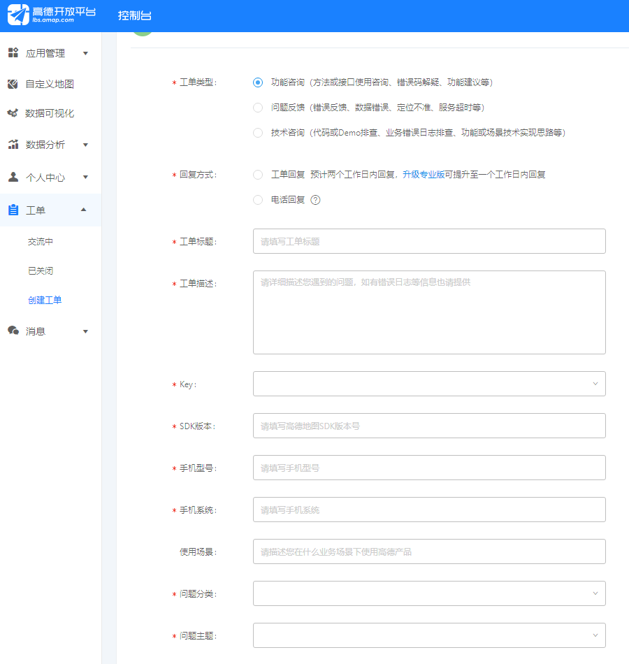
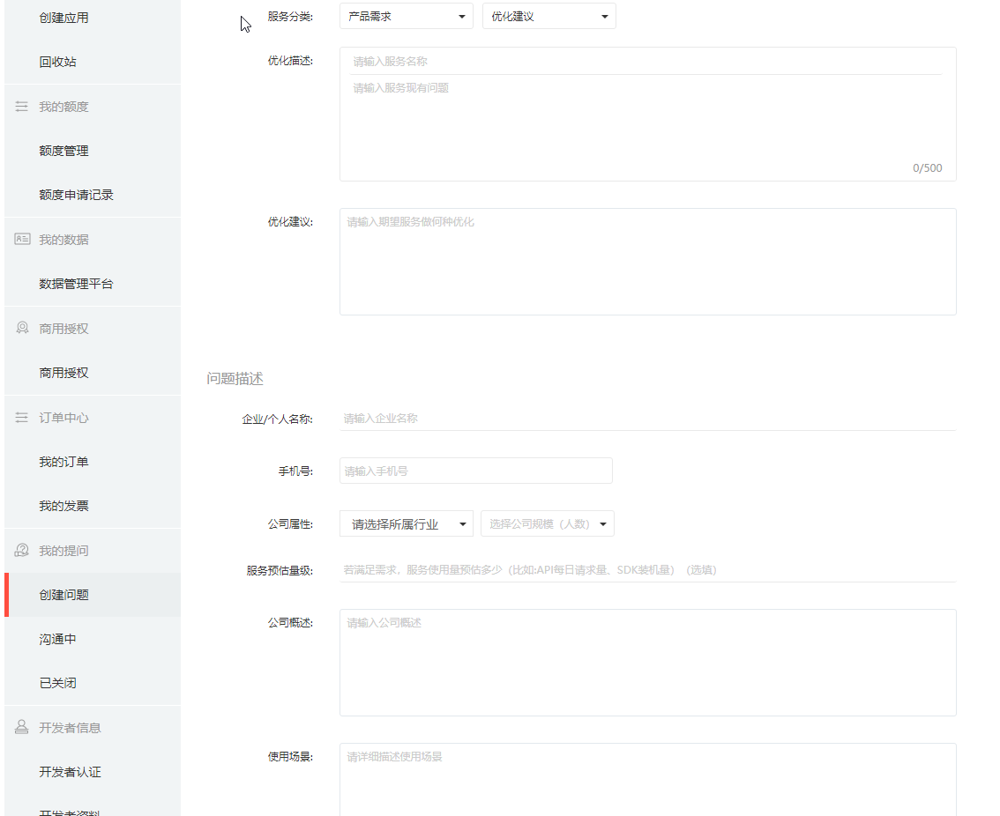
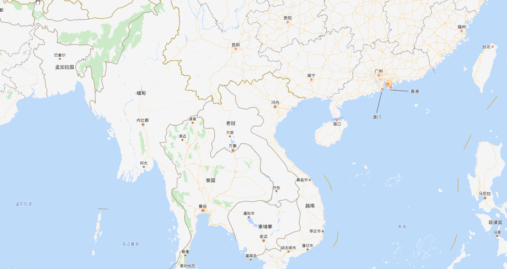
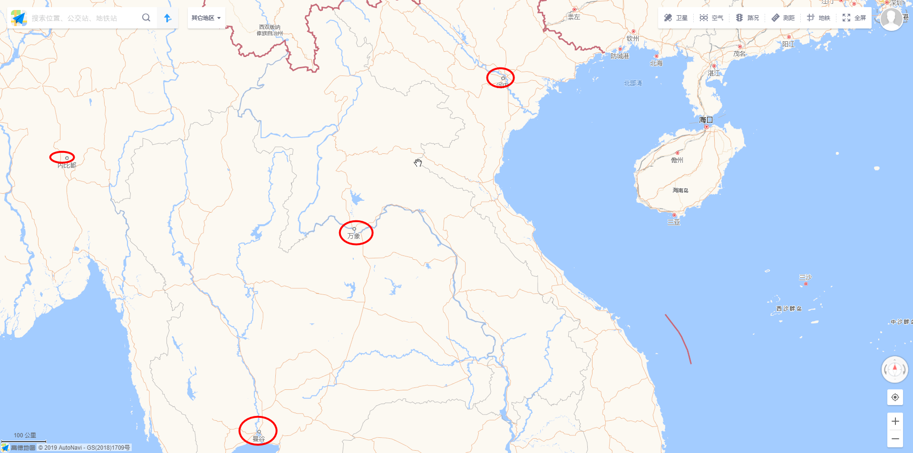

### 高德和百度地图API对比
>开发本项目时前后用过两个地图服务商，一是百度，二是高德，折腾来折腾去最后写一下文章记录一下过程中的经验，对比一些两者的优略。

#### 坐标系
坐标系就是用来表示地球位置的一种表示方法，大家熟悉的就是经纬度，实际上还有其他表示方法。

百度地图api中采用两种坐标体系，经纬度坐标系和墨卡托投影坐标系。前者单位是度，后者单位是米，具体定义可以参见百科词条解释：[http://baike.baidu.com/view/61394.htm](http://baike.baidu.com/view/61394.htm) 和 [http://baike.baidu.com/view/301981.htm](http://baike.baidu.com/view/301981.htm) 。国际经纬度坐标标准为WGS-84,国内必须至少使用国测局制定的GCJ-02,对地理位置进行首次加密。[百度坐标](http://lbsyun.baidu.com/index.php?title=coordinate)在此基础上，进行了BD-09二次加密措施，更加保护了个人隐私。百度对外接口的坐标系并不是GPS采集的真实经纬度，需要通过坐标转换接口进行转换。

高德地图 Android 定位 SDK 支持返回高德坐标系（GCJ-02坐标系）。

通过两家文档的表示可知高德用的是国家标准的坐标系，百度在此基础上又进行了二次加密形成了百度自己的坐标系，不过还好两家都提供了各种坐标系转换的接口所以在坐标系选择上不用考虑那么多，即使你用百度的定位获取到的坐标系你使用高德地图通过转换一样能正常展示位置。

#### 接口、功能和组件
两家的接口基本和功能基本都差不多，个人感觉是百度的接口保守而死板。差别比较大的是组件这块，高德地图基于基本组件封装了很多高级UI组件用起来很方便，并且都是继承关系，接口清晰。百度地图虽然也提供了开源库，但是那种开源库明显是有特定需求的组件，并且用起来好像并不简单。因此我感觉高德的组件封装的很好，百度的组件封装太烂了，就连有些基础组件即没有高级功能也没有应有的灵活性。
比如“自动补全搜索关键字并在地图上展示地点”这个需求来说，以下分别是两家的实现代码：
高德的：
```html
<!doctype html>
<html lang="zh-CN">

<head>
    <!-- 原始地址：//webapi.amap.com/ui/1.0/ui/misc/PoiPicker/examples/index.html -->
    <base href="//webapi.amap.com/ui/1.0/ui/misc/PoiPicker/examples/" />
    <meta charset="utf-8">
    <meta name="viewport" content="initial-scale=1.0, user-scalable=no, width=device-width">
    <title>输入框选择POI点</title>
    <style>
    html,
    body,
    #container {
        width: 100%;
        height: 100%;
        margin: 0px;
        font-size: 13px;
    }
    
    #pickerBox {
        position: absolute;
        z-index: 9999;
        top: 50px;
        right: 30px;
        width: 300px;
    }
    
    #pickerInput {
        width: 200px;
        padding: 5px 5px;
    }
    
    #poiInfo {
        background: #fff;
    }
    
    .amap_lib_placeSearch .poibox.highlight {
        background-color: #CAE1FF;
    }
    
    .amap_lib_placeSearch .poi-more {
        display: none!important;
    }
    </style>
</head>

<body>
    <div id="container" class="map" tabindex="0"></div>
    <div id="pickerBox">
        <input id="pickerInput" placeholder="输入关键字选取地点" />
        <div id="poiInfo"></div>
    </div>
    <script type="text/javascript" src='//webapi.amap.com/maps?v=1.4.14&key=您申请的key值'></script>
    <!-- UI组件库 1.0 -->
    <script src="//webapi.amap.com/ui/1.0/main.js?v=1.0.11"></script>
    <script type="text/javascript">
    var map = new AMap.Map('container', {
        zoom: 10
    });

    AMapUI.loadUI(['misc/PoiPicker'], function(PoiPicker) {

        var poiPicker = new PoiPicker({
            //city:'北京',
            input: 'pickerInput'
        });

        //初始化poiPicker
        poiPickerReady(poiPicker);
    });

    function poiPickerReady(poiPicker) {

        window.poiPicker = poiPicker;

        var marker = new AMap.Marker();

        var infoWindow = new AMap.InfoWindow({
            offset: new AMap.Pixel(0, -20)
        });

        //选取了某个POI
        poiPicker.on('poiPicked', function(poiResult) {

            var source = poiResult.source,
                poi = poiResult.item,
                info = {
                    source: source,
                    id: poi.id,
                    name: poi.name,
                    location: poi.location.toString(),
                    address: poi.address
                };

            marker.setMap(map);
            infoWindow.setMap(map);

            marker.setPosition(poi.location);
            infoWindow.setPosition(poi.location);

            infoWindow.setContent('POI信息: <pre>' + JSON.stringify(info, null, 2) + '</pre>');
            infoWindow.open(map, marker.getPosition());

            //map.setCenter(marker.getPosition());
        });

        poiPicker.onCityReady(function() {
            poiPicker.suggest('美食');
        });
    }
    </script>
</body>

</html>
```
百度的：
```html
<!DOCTYPE html>
<html>
<head>
	<meta http-equiv="Content-Type" content="text/html; charset=utf-8" />
	<meta name="viewport" content="initial-scale=1.0, user-scalable=no" />
	<style type="text/css">
		body, html{width: 100%;height: 100%;margin:0;font-family:"微软雅黑";font-size:14px;}
		#l-map{height:300px;width:100%;}
		#r-result{width:100%;}
	</style>
	<script type="text/javascript" src="http://api.map.baidu.com/api?v=2.0&ak=您的密钥"></script>
	<title>关键字输入提示词条</title>
</head>
<body>
	<div id="l-map"></div>
	<div id="r-result">请输入:<input type="text" id="suggestId" size="20" value="百度" style="width:150px;" /></div>
	<div id="searchResultPanel" style="border:1px solid #C0C0C0;width:150px;height:auto; display:none;"></div>
</body>
</html>
<script type="text/javascript">
	// 百度地图API功能
	function G(id) {
		return document.getElementById(id);
	}

	var map = new BMap.Map("l-map");
	map.centerAndZoom("北京",12);                   // 初始化地图,设置城市和地图级别。

	var ac = new BMap.Autocomplete(    //建立一个自动完成的对象
		{"input" : "suggestId"
		,"location" : map
	});

	ac.addEventListener("onhighlight", function(e) {  //鼠标放在下拉列表上的事件
	var str = "";
		var _value = e.fromitem.value;
		var value = "";
		if (e.fromitem.index > -1) {
			value = _value.province +  _value.city +  _value.district +  _value.street +  _value.business;
		}    
		str = "FromItem<br />index = " + e.fromitem.index + "<br />value = " + value;
		
		value = "";
		if (e.toitem.index > -1) {
			_value = e.toitem.value;
			value = _value.province +  _value.city +  _value.district +  _value.street +  _value.business;
		}    
		str += "<br />ToItem<br />index = " + e.toitem.index + "<br />value = " + value;
		G("searchResultPanel").innerHTML = str;
	});

	var myValue;
	ac.addEventListener("onconfirm", function(e) {    //鼠标点击下拉列表后的事件
	var _value = e.item.value;
		myValue = _value.province +  _value.city +  _value.district +  _value.street +  _value.business;
		G("searchResultPanel").innerHTML ="onconfirm<br />index = " + e.item.index + "<br />myValue = " + myValue;
		
		setPlace();
	});

	function setPlace(){
		map.clearOverlays();    //清除地图上所有覆盖物
		function myFun(){
			var pp = local.getResults().getPoi(0).point;    //获取第一个智能搜索的结果
			map.centerAndZoom(pp, 18);
			map.addOverlay(new BMap.Marker(pp));    //添加标注
		}
		var local = new BMap.LocalSearch(map, { //智能搜索
		  onSearchComplete: myFun
		});
		local.search(myValue);
	}
</script>
```
百度的`BMap.Autocomplete`组件竟然没返回坐标，还要再用`BMap.LocalSearch`组件搜索一次，这封装效果，简洁程度对比一下子就能看出来了。

#### 文档和DEMO
都以`JavaScript API`为例，[高德的教程](https://lbs.amap.com/api/javascript-api/summary)文档详细很多，[百度的开发指南](http://lbsyun.baidu.com/index.php?title=jspopular3.0/guide/mark)就只是列举了简单的例子，很多高级操作并没有，并且有些DEMO竟然还报错。
百度的文档竟然不能搜索关键字，你想想多可怕，你要找一个点的知识要翻遍所有文档吗？这一点跟腾讯有点一拼。
百度的组件类参考里面竟然只有方法和时间，没有列出来属性，你是打算让开发者自己猜吗？
说实话用过高德的文档后实在不想再用百度的文档了，真的头大。

#### 工单系统
高德一开始就有工单系统，百度最开始是一个论坛，不过论坛不咋活跃，最近才改为工单系统，工单系统也是商业化的一个前兆吧，因为高德之前工单系统都是免费的没限制，最近个人版每个月只能免费提问一次，估计百度后面也要这样搞了。
对比两个的工单系统，高德的要简单的过，百度的工单系统公司概述和使用场景很坑爹，要填的太多。
高德工单系统：


百度的工单系统：


#### 地图展示
实话实说，在某个层级的展示内容上百度地图的展示要相对丰富很多，而高德的就简陋很多，这也可能是经验问题，毕竟百度做地图时间也挺久了，以台湾省为例：
百度台湾省：


高德台湾省：

差别还是很明显的。

#### 国际化支持
百度支持国际化定位和展示，高德不支持国际化详细位置展示，只能显示国家首都，这一点大家使用的时候注意，如果你的产品一定要国际化支持，那么你要考虑一下，高德海外地图还在申请内测阶段。
百度国际化地图展示：


高德国际化地图展示：


#### API更新频率
截止到本文章发表时，百度API最后更新是2017年了，高德基本两个多月更新一次。

#### 总结
1. 高德的地图可视化方面做的比百度好
2. 高德的文档和DEMO更细致，对开发者更友好
3. 高德反馈速度较快
4. 百度地图在地图展示方面比比高德更有经验
5. 百度地图支持海外地图展示，高德还在申请内测阶段
