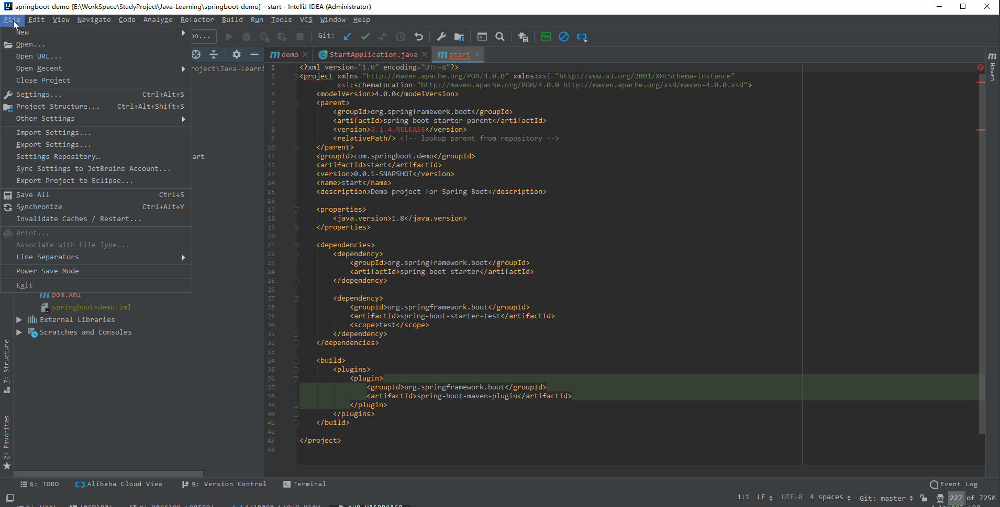
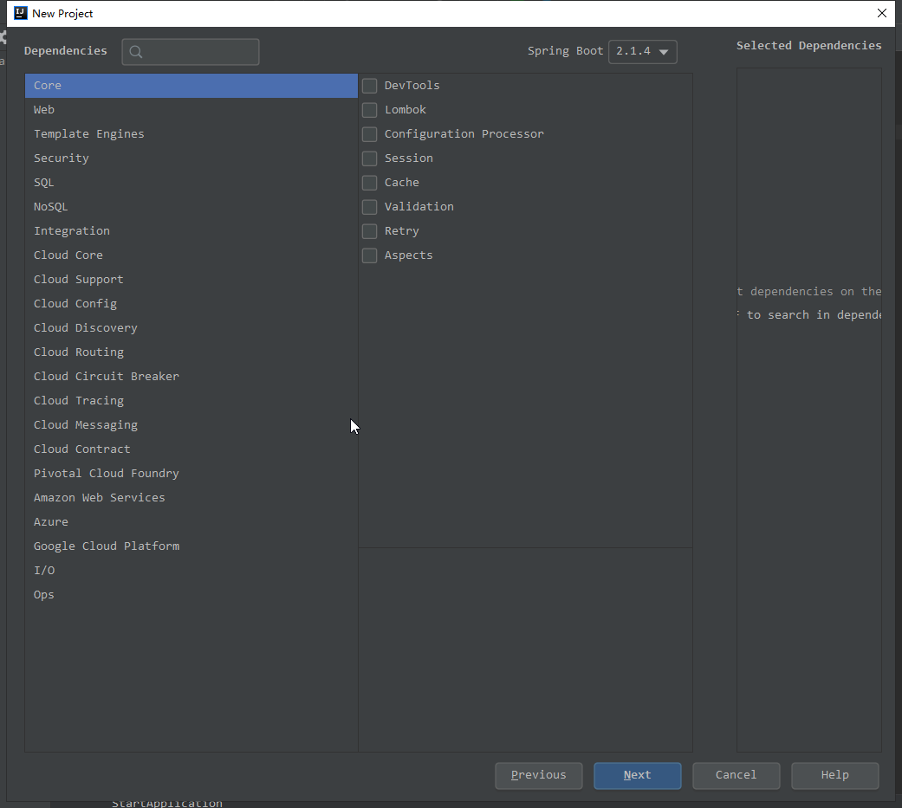
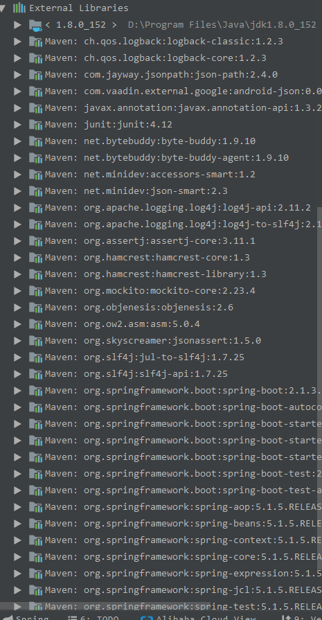
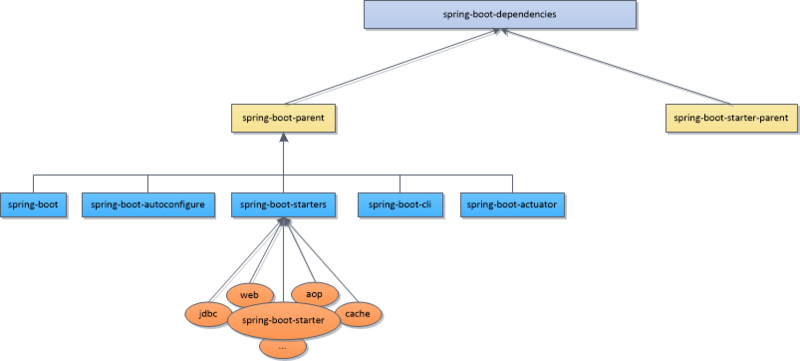

### springboot是什么

springboot框架是spring framework发展史上一次质的飞跃。它不仅仅是简化了繁琐的配置文件，提高了开发效率，整合了开发中常用的各种组件，优雅地处理了它们之间的版本兼容性问题，等等。说白了之前用springmvc+spring的时候需要一大堆配置，现在不需要你弄一大堆XML配置，spring会用默认配置来实现最小化配置保证项目正常运行，基本上是依赖一个组件就能使用这个组件的功能，当然了自定义的配置也是很方便的，更符合了微服务的发展方向。

### 新建一个简单的springboot项目

根据个人喜好，本人使用Idea操作，其他工具大致类似，过程下图所示： 



其中，如下图所示有很多可选项：



这些可选项都是spring官方支持的组件，在新建项目的时候根据自己的需求进行选择，当然如果新建项目的时候不选择，后面也可以自己添加到项目的maven依赖中即可。

### springboot的依赖关系

新建项目后默认会是如下依赖方式：
```xml
<?xml version="1.0" encoding="UTF-8"?>
<project xmlns="http://maven.apache.org/POM/4.0.0" xmlns:xsi="http://www.w3.org/2001/XMLSchema-instance"
         xsi:schemaLocation="http://maven.apache.org/POM/4.0.0 http://maven.apache.org/xsd/maven-4.0.0.xsd">
    <modelVersion>4.0.0</modelVersion>
    <parent>
        <groupId>org.springframework.boot</groupId>
        <artifactId>spring-boot-starter-parent</artifactId>
        <version>2.1.4.RELEASE</version>
        <relativePath/> <!-- lookup parent from repository -->
    </parent>
    <groupId>com.springboot.demo</groupId>
    <artifactId>start</artifactId>
    <version>0.0.1-SNAPSHOT</version>
    <name>start</name>
    <description>Demo project for Spring Boot</description>

    <properties>
        <java.version>1.8</java.version>
    </properties>

    <dependencies>
        <dependency>
            <groupId>org.springframework.boot</groupId>
            <artifactId>spring-boot-starter</artifactId>
        </dependency>

        <dependency>
            <groupId>org.springframework.boot</groupId>
            <artifactId>spring-boot-starter-test</artifactId>
            <scope>test</scope>
        </dependency>
    </dependencies>

    <build>
        <plugins>
            <plugin>
                <groupId>org.springframework.boot</groupId>
                <artifactId>spring-boot-maven-plugin</artifactId>
            </plugin>
        </plugins>
    </build>

</project>
```
也就是项目总体依赖一个springboot的父项目，这样由于依赖传递，自己的项目就依赖了springboot所需要的基本组件和属性，如图所示：



这样的依赖方式好处是简单，但另一方面不够灵活，因为现在的项目大部分本身是父子结构所以继承`spring-boot-starter-parent`不太合适，还有另外一种方式：
```xml
<dependencyManagement>
    <dependencies>
            <dependency>
                <groupId>org.springframework.boot</groupId>
                <artifactId>spring-boot-dependencies</artifactId>
                <version>2.1.3.RELEASE</version>
                <type>pom</type>
                <scope>import</scope>
            </dependency>
    </dependencies>
</dependencyManagement>
```
把上面代码添加到自己的父项目中，子项目就自动依赖了springboot的默认依赖。

`spring-boot-dependencies`的依赖关系如下图：



参考：
[parent 或者 spring-boot-dependencies引入spring boot](https://www.jianshu.com/p/8c0fb8ade2dc)

### springboot打包
如果项目需要打包成jar或者war，需要在`pom.xml`里面加入如下配置：
```xml
<build>
        <plugins>
            <plugin>
                <groupId>org.springframework.boot</groupId>
                <artifactId>spring-boot-maven-plugin</artifactId>
                <configuration>
                    <!-- 指定该Main Class为全局的唯一入口 -->
<mainClass>com.springboot.demo.cache.DemoCacheApplication</mainClass>
                    <layout>ZIP</layout>
                </configuration>
                <executions>
                    <execution>
                        <goals>
                        	<!--可以把依赖的包都打包到生成的Jar包中-->
                            <goal>repackage</goal>
                        </goals>
                    </execution>
                </executions>
            </plugin>

        </plugins>
    </build>
```

### 常用依赖项
以下列举了比较常用的依赖：

`lombok`：让你不再繁琐的写Getter和Setter等

`hutool`：开源集合工具类